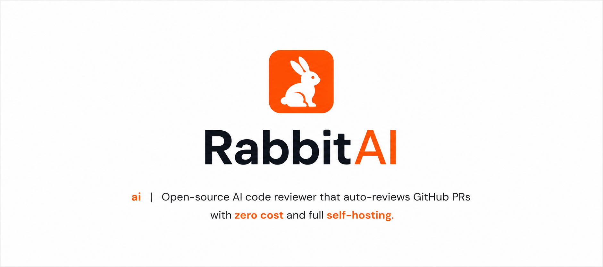

<p align="center">
  
</p>

<h1 align="center">RabbitAI — AI Code Reviewer</h1>

<p align="center">
  Open-source AI code reviewer that auto-reviews GitHub PRs with zero cost and full self-hosting.
</p>

<p align="center">
  <a href="https://github.com/nikhilsaiankilla/rabbitai/blob/main/LICENSE"></a>
  <a href="https://python.org"></a>
  <a href="https://langchain-ai.github.io/langgraph"></a>
  <a href="https://aistudio.google.com"></a>
</p>

---

## What is RabbitAI?

RabbitAI is an open-source AI code reviewer. Drop one workflow file into any repo and it reviews every PR automatically — catching bugs, security issues, and performance problems — and posts a structured comment directly on the PR.

Unlike other code reviewers, RabbitAI:

- Builds a **knowledge graph** of your codebase to detect blast radius of changes
- Uses **mem0 persistent memory** to get smarter with every PR it reviews
- Supports **Gemini and OpenAI** for both LLM and embeddings — fully config-driven
- Supports **ChromaDB, Pinecone, and Qdrant** as vector stores
- Runs as a **GitHub Action**, **MCP server** inside Claude/Cursor, or **local CLI**
- Runs **completely free** using Gemini free tier + local ChromaDB

---

## Demo

```
RabbitAI Code Review  ·  7/10

[BUG]
auth.ts line 23: user.id can be undefined if session expires before check

[SECURITY]
db.ts line 45: query is not parameterized — SQL injection risk

[PERFORMANCE]
dashboard.tsx line 89: value recalculated on every render, consider useMemo

[GOOD]
Error boundaries correctly implemented throughout
TypeScript types well-defined across all components

Note: db.ts has 12 dependents — this change is marked HIGH BLAST RADIUS

---
RabbitAI · AI-powered code review · MIT License
```

---

## How It Works

```
PR opened
→ Fetch diff + metadata via GitHub API
→ Build NetworkX file dependency graph (blast radius detection)
→ Classify change type (bug fix / feature / refactor / security)
→ Chunk diff → embed → store in vector DB
→ Load repo memory from mem0 (past learnings)
→ Retrieve relevant chunks via semantic search
→ LLM reviews with full context + memory + graph insights
→ Post structured comment on PR
→ Save new learnings to mem0
```

---

## Quick Start

### Option 1 — GitHub Action (recommended)

Add `.github/workflows/review.yml` to your repo:

```yaml
name: RabbitAI Code Review

on:
  pull_request:
    types: [opened, synchronize, reopened]

jobs:
  review:
    runs-on: ubuntu-latest
    permissions:
      pull-requests: write
      contents: read
    steps:
      - name: Checkout RabbitAI
        uses: actions/checkout@v4
        with:
          repository: nikhilsaiankilla/rabbitai
          path: rabbitai

      - name: Set up Python
        uses: actions/setup-python@v5
        with:
          python-version: "3.11"

      - name: Cache dependencies
        uses: actions/cache@v4
        with:
          path: ~/.cache/pip
          key: ${{ runner.os }}-pip-${{ hashFiles('rabbitai/requirements.txt') }}

      - name: Install dependencies
        run: pip install -r rabbitai/requirements.txt

      - name: Run RabbitAI
        env:
          GEMINI_API_KEY: ${{ secrets.GEMINI_API_KEY }}
          GITHUB_TOKEN: ${{ secrets.GITHUB_TOKEN }}
          PINECONE_API_KEY: ${{ secrets.PINECONE_API_KEY }}
          OPENAI_API_KEY: ${{ secrets.OPENAI_API_KEY }}
          GITHUB_REPOSITORY: ${{ github.repository }}
          PR_NUMBER: ${{ github.event.pull_request.number }}
          VECTOR_STORE_PROVIDER: ${{ vars.VECTOR_STORE_PROVIDER }}
          EMBEDDING_PROVIDER: ${{ vars.EMBEDDING_PROVIDER }}
          LLM_PROVIDER: ${{ vars.LLM_PROVIDER }}
          LLM_MODEL: ${{ vars.LLM_MODEL }}
          REVIEW_LANGUAGE: ${{ vars.REVIEW_LANGUAGE }}
        run: |
          cd rabbitai
          python -c "
          import os
          from agent import run
          result = run(os.environ['GITHUB_REPOSITORY'], int(os.environ['PR_NUMBER']))
          print(result.comment_url if result.posted else result.reason)
          "
```

Add `GEMINI_API_KEY` to your repo secrets — get one free at [aistudio.google.com](https://aistudio.google.com).

`GITHUB_TOKEN` is injected automatically. Open a PR — done.

---

### Option 2 — MCP Server (Claude / Cursor)

```bash
git clone https://github.com/nikhilsaiankilla/rabbitai
cd rabbitai
pip install -r requirements.txt
cp config.example.yaml config.yaml
# fill in your config.yaml
python mcp/server.py
```

Add to your Claude or Cursor MCP config:

```json
{
  "mcpServers": {
    "rabbitai": {
      "command": "python",
      "args": ["/absolute/path/to/rabbitai/mcp/server.py"]
    }
  }
}
```

Then type in Claude or Cursor: `"Review PR #12 in owner/myrepo"`

---

### Option 3 — Local CLI

```bash
git clone https://github.com/nikhilsaiankilla/rabbitai
cd rabbitai
pip install -r requirements.txt
cp config.example.yaml config.yaml
# fill in your config.yaml
```

```python
# test.py
from agent import run

result = run(repo_name="your-username/your-repo", pr_number=1)
print(result)
```

```bash
python test.py
```

---

## Stack

| Layer            | Default                     | Alternatives           |
| ---------------- | --------------------------- | ---------------------- |
| LLM              | Gemini 2.0 Flash (free)     | GPT-4.1-mini           |
| Embeddings       | Gemini embedding-001 (free) | text-embedding-3-small |
| Vector store     | ChromaDB (local, free)      | Pinecone, Qdrant       |
| Memory           | mem0 (local, free)          | —                      |
| Dependency graph | NetworkX (free)             | —                      |
| Workflow         | LangGraph (free)            | —                      |
| **Total**        |                             | **$0/month**           |

---

## Configuration

Copy `config.example.yaml` to `config.yaml` and fill in your values.

```yaml
github_token: "" # local dev only — Actions injects GITHUB_TOKEN automatically
gemini_api_key: "" # free at aistudio.google.com

embedding:
  provider: "gemini" # gemini | openai
  model: "" # leave empty for provider default
  api_key: "" # openai only

llm:
  provider: "gemini" # gemini | openai
  model: "" # leave empty for provider default
  api_key: "" # openai only

vector_store:
  provider: "chromadb" # chromadb | pinecone | qdrant
  path: "./chroma_db" # for chromadb only
  collection: "pr-chunks"

memory:
  enabled: true
  repo_context: |
    Describe your repo so RabbitAI understands it from day one.

review:
  language: "typescript"
  focus:
    - bugs
    - security
    - performance
  min_risk_score: 0 # 0 = always post
  post_score: true
```

All values can be overridden with environment variables. See the [full docs](https://rabbitai.nikhilsai.in/docs) for provider setup, dimension reference, and all config options.

---

## Project Structure

```
rabbitai/
├── .github/workflows/review.yml   ← GitHub Action trigger
├── nodes/
│   ├── fetcher.py                 ← fetch PR diff + metadata
│   ├── graph_builder.py           ← NetworkX dependency graph + blast radius
│   ├── classifier.py              ← change type detection
│   ├── embedder.py                ← embeddings + vector DB storage
│   ├── retriever.py               ← semantic search over stored chunks
│   ├── reviewer.py                ← LLM review generation
│   └── poster.py                  ← GitHub PR comment poster
├── memory/repo_memory.py          ← mem0 persistent memory
├── mcp/server.py                  ← MCP server for Claude/Cursor
├── utils/
│   ├── config.py                  ← config loader + env var overrides
│   └── prompts.py                 ← review prompt templates
├── agent.py                       ← LangGraph 9-node workflow entry point
├── config.example.yaml
└── requirements.txt
```

---

## Roadmap

- [x] 9-node LangGraph workflow
- [x] NetworkX knowledge graph + blast radius detection
- [x] ChromaDB, Pinecone, and Qdrant support
- [x] Gemini and OpenAI for LLM and embeddings
- [x] mem0 persistent memory
- [x] MCP server for Claude/Cursor
- [ ] GitLab and Bitbucket support
- [ ] Web dashboard for review history
- [ ] Slack and Discord notifications
- [ ] Fine-tuned prompts per language

---

## Contributing

PRs welcome. RabbitAI reviews its own PRs.

1. Fork the repo
2. Create your branch — `git checkout -b feat/your-feature`
3. Commit — `git commit -m 'feat: your feature'`
4. Push and open a PR

---

## License

MIT — use it, fork it, self-host it, build on it.

---

**Built by [Nikhil Sai](https://nikhilsai.in)** · [@itzznikhilsai](https://x.com/itzznikhilsai)

If this helped you, star the repo ⭐ and share it on X.
